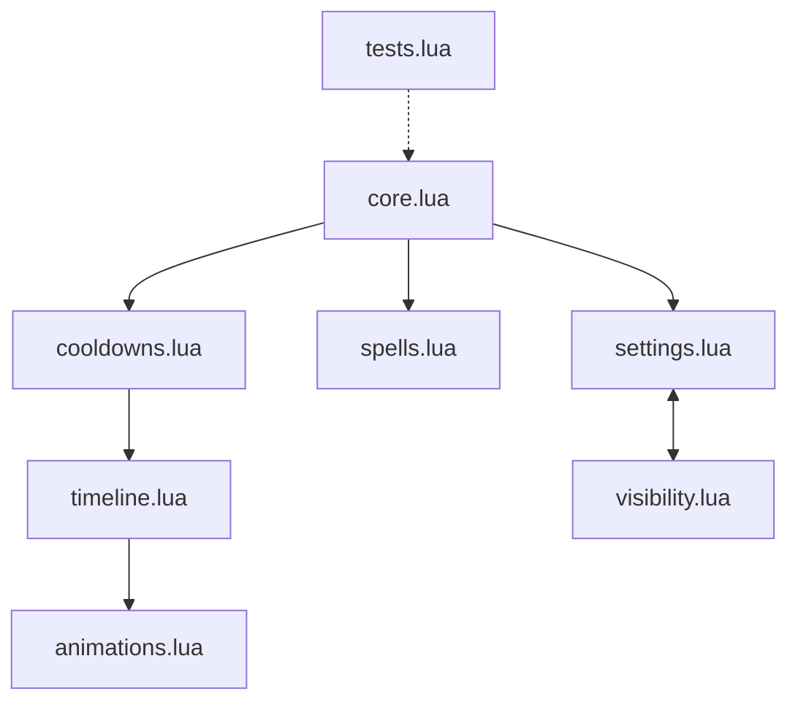

# LoremCooldownTracker (LCT) Codebase Summary

## Quick Overview
- **Project Type**: World of Warcraft Classic Era Addon
- **Purpose**: Track and display spell cooldowns with visual timeline
- **Version**: 0.1.0-alpha
- **Development Stage**: Early development with core functionality implemented
- **Language**: Lua
- **Framework**: World of Warcraft API + Ace3
- **Target Game Version**: Classic Era (1.15.1)

## Semantic Overview
```yaml
namespace: LCT
primary_purpose: cooldown_tracking
ui_type: timeline
saved_variables: LoremCTDB
event_driven: true
dependencies:
  - LibStub
  - CallbackHandler-1.0
  - AceGUI-3.0
  - AceConfig-3.0
  - AceConsole-3.0
  - LibDataBroker-1.1
  - LibDBIcon-1.0
```

## File Structure and Module Relationships


## Key Components Summary

### 1. Core System (core.lua)
```lua
-- Namespace and Version Control
LCT = {} -- Main addon namespace
LCT.version = "0.1.0-alpha"
LCT.debug = false

-- Key Functions
function LCT:Debug(...)  -- Debug logging
function LCT:Initialize()  -- Addon initialization
function LCT:OnEvent(event, ...)  -- Event handling

-- Default Settings
LCT.defaults = {
    barWidth = 300,
    barHeight = 30,
    iconSize = 24
}
```
**Purpose**: Entry point and core initialization
**Dependencies**: None (root module)
**Initialized By**: WoW Client
**Initializes**: All other modules
**Status**: ✅ Implemented

### 2. Cooldown System (cooldowns.lua)
```lua
-- State Management
LCT.cooldowns = {}
LCT.activeCooldowns = {}

-- Key Functions
function cooldowns.UpdateCooldown(spellID, isItem)
function cooldowns.UpdateAll()
function cooldowns.Initialize()

-- Events Handled
- SPELL_UPDATE_COOLDOWN
- SPELL_UPDATE_CHARGES
```
**Purpose**: Cooldown tracking and management
**Dependencies**: core.lua, spells.lua
**Consumed By**: timeline.lua
**Status**: ✅ Implemented

### 3. Animation System (animations.lua)
```lua
LCT.animations = {
    StartPositionAnimation = function(icon, targetX, remaining),
    StartFinishAnimation = function(icon),
    CancelAnimation = function(icon)
}
```
- Manages position animations for cooldown icons
- Handles finish animations and scaling effects
- Controls animation timing and transitions
- Status: ✅ Implemented

### 4. Timeline System (timeline.lua)
```lua
LCT.timeline = {
    UpdateMarkers = function(),
    Initialize = function()
}
```
- Manages timeline visualization
- Updates time markers and positions
- Handles resize events and updates
- Status: ✅ Implemented

### 5. Spell System (spells.lua)
```lua
LCT.spells = {
    Initialize = function(),
    ScanSpellBook = function()
}
```
- Tracks learned spells and abilities
- Manages spell scanning and updates
- Handles spell-related events
- Status: ✅ Implemented

### 6. Visibility System (visibility.lua)
```lua
LCT.visibility = {
    shown = true,
    UpdateIconVisibility = function(),
    SaveSettings = function(),
    LoadSettings = function()
}
```
- Controls frame and icon visibility
- Manages opacity and display settings
- Handles settings persistence
- Status: ✅ Implemented

### 7. Settings System (settings.lua)
```lua
LCT.settings = {
    CreateInputBox = function(),
    UpdateDimensionControls = function(),
    UpdateVisibilityControls = function()
}
```
- Provides settings UI and controls
- Manages dimension and visibility settings
- Integrates with minimap button
- Status: ✅ Implemented

## Data Flow Diagrams

### 1. Cooldown Update Flow
```
[WoW Event: SPELL_UPDATE_COOLDOWN]
         ↓
[spells.lua: ScanSpellBook]
         ↓
[cooldowns.lua: UpdateCooldown]
         ↓
[timeline.lua: UpdateMarkers]
         ↓
[animations.lua: StartPositionAnimation]
```

### 2. Settings Update Flow
```
[User Input] → [settings.lua] → [visibility.lua]
                    ↓
            [SavedVariables DB]
                    ↓
            [Load on Startup]
```

## Key Concepts for LLM Analysis

### State Management Hierarchy
```yaml
Global State:
  - LCT: Root namespace
  - LoremCTDB: Persistent storage
Module State:
  - activeCooldowns: Current cooldowns
  - trackedSpells: Monitored spells
  - frame: Main UI reference
Local State:
  - updateElapsed: Update throttling
  - isResizing: UI state
```

### Event Registration Pattern
```lua
-- Standard Event Registration
local frame = CreateFrame("Frame")
frame:RegisterEvent("EVENT_NAME")
frame:SetScript("OnEvent", handler)

-- Throttled Update Pattern
local elapsed = 0
frame:SetScript("OnUpdate", function(self, delta)
    elapsed = elapsed + delta
    if elapsed >= THRESHOLD then
        -- Perform update
        elapsed = 0
    end
end)
```

### Settings Management Pattern
```lua
-- Save Pattern
if not LoremCTDB then LoremCTDB = {} end
LoremCTDB.category = value

-- Load Pattern
value = LoremCTDB.category or default

-- Default Fallback Pattern
function GetSetting(category, key)
    return LoremCTDB[category]?[key] or LCT.defaults[key]
end
```

## Notes for LLM Analysis
1. **Architecture Pattern**: Event-driven modular design
2. **State Management**: Hierarchical with global namespace
3. **Update Pattern**: Throttled OnUpdate with event triggers
4. **Settings Pattern**: Persistent with defaults fallback
5. **UI Pattern**: Frame-based with timeline visualization
6. **Error Handling**: Debug logging with graceful fallbacks
7. **Module Pattern**: Self-contained with explicit dependencies

## Common Pitfalls and Considerations
1. Event order dependency between modules
2. Frame update throttling requirements
3. SavedVariables timing constraints
4. WoW API state availability timing
5. Frame scale and position persistence
6. Cooldown timing precision requirements
7. Animation frame rate considerations 